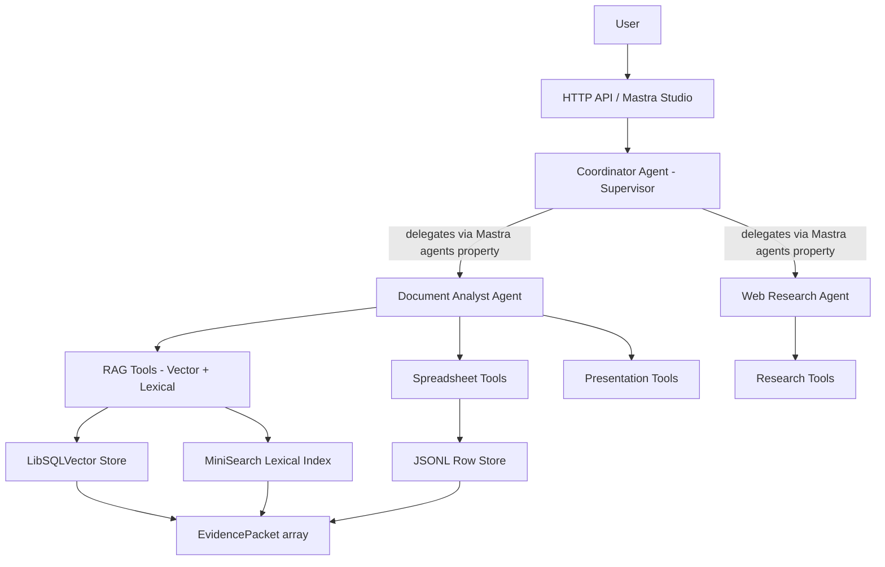

# Design Document — Mastra Multi-Agent RAG Chatbot

> **Status:** Ready for implementation  
> **Date:** 2026-05-19  
> **Approach:** Fresh start, 3 phases, all problems from spec review addressed

---

## What We're Building

A general-purpose chatbot that can:

1. Answer research questions by looking up information on the web.
2. Analyze user-uploaded PDFs, PowerPoints, Excel files, CSV files, and Word documents.

Built on **Mastra** with a **multi-agent architecture** using the native supervisor delegation pattern. Uses a **hybrid RAG pipeline** — Mastra vector retrieval for narrative docs, structured tools for spreadsheets, lexical fallback when no embedding provider is configured.

---

## Current State Audit

### What Already Works

| Component | Status | Location |
|-----------|--------|----------|
| Session-scoped upload model | ✅ Working | `src/document-store/` |
| File extractors (PDF, DOCX, PPTX, Excel, CSV) | ✅ Working | `src/extractors/` |
| Extraction → manifest → derived_paths pipeline | ✅ Working | `src/ingestion/documentWorker.ts` |
| Lexical text index (MiniSearch) | ✅ Working | `src/retrieval/textIndex.ts` |
| Vector index scaffolding (MDocument + LibSQLVector) | ✅ Scaffolded | `src/retrieval/vectorIndex.ts` |
| Capability-based tool modules | ✅ Organized | `src/mastra/tools/` |
| EvidencePacket type system | ✅ Defined | `src/types.ts` |
| HTTP API + basic UI | ✅ Working | `src/server.ts`, `src/ui/` |
| Mastra registration (agents, storage, vectors) | ✅ Registered | `src/mastra/index.ts` |

### What's Broken or Missing

| Problem | Detail | Fixed In |
|---------|--------|----------|
| Coordinator is NOT a supervisor agent | Uses manual `routeIntent()` regex, not Mastra's `agents` property | Phase 1 |
| Memory has no storage provider | `Memory({})` won't persist across restarts | Phase 1 |
| ragTools don't use Mastra RAG | They call custom `services/documentTools.ts` lexical search only | Phase 2 |
| No vector ingestion wired in documentWorker | `buildVectorIndexForFile` exists but isn't called from ragTools path | Phase 2 |
| Embedding dimension not specified at startup | Index created lazily with whatever dimension comes first | Phase 1 |
| BPSS-specific naming in config/scripts | `DEFAULT_SESSION_ID = "bpss-demo"`, script names | Phase 3 |
| No Mastra workflows | Ingestion + answer flows are imperative code | Phase 3 |

---

## Architecture



### Agent Design

**3 agents. No more.**

| Agent | Role | Tools | Delegates To |
|-------|------|-------|--------------|
| `coordinatorAgent` | Supervisor. Classifies intent, delegates to specialists. | `documentsListTool`, `documentsGetStatusTool` | `documentAnalystAgent`, `researchAgent` |
| `documentAnalystAgent` | Answers questions over uploaded files with citations. | RAG tools, spreadsheet tools, presentation tools | — |
| `researchAgent` | Web research with source URLs. | `researchSearchWebTool` | — |

### Coordination Mechanism

The coordinator uses **Mastra's native supervisor agent pattern**:

```typescript
const coordinatorAgent = new Agent({
  id: 'coordinatorAgent',
  description: 'Routes requests to document analysis or web research specialists.',
  instructions: coordinatorInstructions,
  model: getDefaultModel(),
  memory: defaultMemory,
  agents: { documentAnalystAgent, researchAgent },
  tools: { documentsListTool, documentsGetStatusTool },
});
```

The `routeIntent()` regex helper stays as a **deterministic pre-filter** in `server.ts` for obvious cases (manifest, intake) that don't need LLM reasoning. The supervisor handles all ambiguous routing via its instructions + subagent descriptions.

### RAG Pipeline Design

```
File Upload → Extractor → derivedPaths on disk → documentWorker
                                                       |
                                              Narrative?  or  Spreadsheet?
                                                 |                 |
                                    MDocument.fromMarkdown   Skip embedding
                                    chunk(semantic-markdown)  Use structured
                                    embed via embedV1         tools at query
                                    LibSQLVector.upsert       time
                                                 |
                                    Vector query  or  Lexical fallback
                                    (embeddings       (no provider or
                                     available)        zero results)
                                                 |
                                         EvidencePacket[]
```

### Embedding Dimension Strategy

- **Default:** 768 (Gemini `text-embedding-004`)
- **OpenAI fallback:** 1536 (`text-embedding-3-small`)
- **Resolution:** Create index at startup based on configured provider. Do NOT switch providers after index creation without rebuilding.

```typescript
function getEmbeddingDimension(): number {
  if (process.env.GEMINI_API_KEY) return 768;
  return 1536;
}
```

---

## Phase 1: Foundation Fixes

> **Goal:** Fix structural problems so the architecture is sound before building RAG.  
> **Estimated effort:** 1-2 sessions

### 1.1 — Make Coordinator a Supervisor Agent

**File:** `src/agents/coordinator.ts`

**Changes:**
- Import `documentAnalystAgent` and `researchAgent`
- Add `agents: { documentAnalystAgent, researchAgent }` to the Agent constructor
- Add a `description` field to the coordinator
- Add `description` fields to `documentAnalystAgent` and `researchAgent` (Mastra uses these to decide delegation)

**Before:**
```typescript
export const coordinatorAgent = new Agent({
  id: "coordinatorAgent",
  name: "CoordinatorRouterAgent",
  instructions: coordinatorInstructions,
  model: getDefaultModel(),
  memory: defaultMemory,
  tools: {
    documentsListTool, documentsGetStatusTool,
    documentsSearchTextTool, researchSearchWebTool,
  },
});
```

**After:**
```typescript
import { documentAnalystAgent } from "./documentAnalystAgent.js";
import { researchAgent } from "./researchAgent.js";

export const coordinatorAgent = new Agent({
  id: "coordinatorAgent",
  name: "CoordinatorRouterAgent",
  description: "Routes user requests to document analysis or web research specialists.",
  instructions: coordinatorInstructions,
  model: getDefaultModel(),
  memory: defaultMemory,
  agents: { documentAnalystAgent, researchAgent },
  tools: { documentsListTool, documentsGetStatusTool },
});
```

**File:** `src/agents/documentAnalystAgent.ts`
- Add: `description: "Analyzes uploaded documents (PDF, DOCX, PPTX, Excel, CSV). Returns evidence-backed answers with file/page/slide/sheet/row citations."`

**File:** `src/agents/researchAgent.ts`
- Add: `description: "Searches the web for current information, facts, and external sources. Returns answers with source URLs."`

**File:** `src/server.ts`
- Keep `routeIntent()` as a pre-filter for deterministic routes (manifest, intake)
- For ambiguous routes → send to `coordinatorAgent` and let Mastra supervisor handle delegation
- Simplify `selectedAgentForRoute` — most routes go to coordinator now

### 1.2 — Fix Memory Persistence

**File:** `src/mastra/memory.ts`

**Before:**
```typescript
export const defaultMemory = new Memory({
  options: { lastMessages: 20, observationalMemory: true },
});
```

**After:**
```typescript
import { LibSQLStore } from "@mastra/libsql";

export const defaultMemory = new Memory({
  storage: new LibSQLStore({ id: "memory-storage", url: mastraDbUrl }),
  options: { lastMessages: 20 },
});
```

> [!WARNING]
> Remove `observationalMemory: true` — experimental feature. Add back in Phase 3 after core is stable.

### 1.3 — Fix Embedding Dimension at Startup

**File:** `src/mastra/vectorStore.ts` — Add `initializeVectorIndex()` function.

**File:** `src/mastra/model.ts` — Add `getEmbeddingDimension()` helper.

**File:** `src/server.ts` — Call `initializeVectorIndex()` at server startup.

### 1.4 — Clean Up Config

**File:** `src/config.ts` — Change `DEFAULT_SESSION_ID` from `"bpss-demo"` to `"default-session"`.

### Phase 1 Checklist

- [ ] Coordinator uses Mastra `agents` property for supervisor delegation
- [ ] All 3 agents have `description` fields
- [ ] Memory has `storage: LibSQLStore` for persistence
- [ ] Vector index created at startup with correct dimension
- [ ] `getEmbeddingDimension()` helper exists in model.ts
- [ ] `initializeVectorIndex()` called from server startup
- [ ] `DEFAULT_SESSION_ID` renamed to generic name
- [ ] `npm run typecheck` passes
- [ ] `npm run server` starts without errors

### Phase 1 Acceptance Criteria

1. `coordinatorAgent` delegates to subagents via Mastra's native mechanism
2. Memory survives server restart
3. Vector index is created with known dimension before any documents are ingested
4. No BPSS-specific naming in config defaults

---

## Phase 2: Mastra RAG Pipeline

> **Goal:** Wire up the full vector retrieval path. ragTools use Mastra RAG for narrative docs, structured tools for spreadsheets, lexical fallback when needed.  
> **Estimated effort:** 2-3 sessions

### 2.1 — Wire Vector Ingestion into documentWorker

**File:** `src/retrieval/indexer.ts`

Currently `buildRetrievalIndexesForFile` builds the lexical text index. Add vector index building:

```typescript
import { buildVectorIndexForFile } from "./vectorIndex.js";

export async function buildRetrievalIndexesForFile(input) {
  const textResult = await buildTextIndexForFile(input);
  const vectorResult = await buildVectorIndexForFile(input);
  return {
    derivedPaths: {
      ...textResult.derivedPaths,
      ...(vectorResult.path ? { vectorIndex: vectorResult.path } : {}),
    },
    warnings: [...textResult.warnings, ...vectorResult.warnings],
  };
}
```

This is called from `documentWorker.ts` which already calls `buildRetrievalIndexesForFile`. No changes needed in documentWorker.

### 2.2 — Rewrite ragTools for Hybrid Retrieval

**File:** `src/mastra/tools/ragTools.ts`

The key change: `documentsRetrieveEvidenceTool` tries vector search first, falls back to lexical.

```typescript
import { searchVectorEvidence } from "../../retrieval/vectorIndex.js";
import { searchTextEvidence } from "../../retrieval/textIndex.js";
import { hasEmbeddingProvider } from "../model.js";

export const documentsRetrieveEvidenceTool = createTool({
  id: "documents.retrieveEvidence",
  description: "Retrieve document evidence. Uses vector search when available, falls back to lexical.",
  inputSchema: z.object({
    ...sessionSchema,
    fileId: z.string().optional(),
    query: z.string().min(1),
    limit: z.number().int().positive().optional(),
  }),
  execute: async (input) => safeExecute("documents.retrieveEvidence", async () => {
    let packets = [];
    let retrievalMode = "lexical";

    if (hasEmbeddingProvider()) {
      const vectorResults = await searchVectorEvidence(input);
      if (vectorResults.length > 0) {
        packets = vectorResults;
        retrievalMode = "vector";
      }
    }

    if (packets.length === 0) {
      packets = await searchTextEvidence(input);
      retrievalMode = "lexical";
    }

    return {
      retrievalMode,
      packets,
      lowEvidence: packets.length < 2,
      lowEvidenceHint: packets.length < 2
        ? "Low evidence. State uncertainty explicitly."
        : undefined,
    };
  }),
});
```

### 2.3 — Verify vectorIndex.ts (Already Correct)

`src/retrieval/vectorIndex.ts` already:

- Uses `MDocument.fromMarkdown()` for document creation
- Uses `semantic-markdown` chunking strategy (maxSize: 900, overlap: 120)
- Embeds via `embedV1` from `@mastra/core/vector`
- Stores via `documentVectorStore.upsert()` with metadata filters
- Queries via `documentVectorStore.query()` with session/file filters
- Skips Excel/CSV (handled by structured tools)
- Handles PDF pages, PPTX slides, DOCX markdown

**No major changes needed.** The problem was ragTools didn't call it.

### 2.4 — Export searchTextEvidence from textIndex.ts

**File:** `src/retrieval/textIndex.ts`

Ensure an exported function with signature matching `searchVectorEvidence`:

```typescript
export async function searchTextEvidence(input: {
  userId: string; sessionId: string;
  fileId?: string; query: string; limit?: number;
}): Promise<EvidencePacket[]>
```

### 2.5 — Update documentAnalystAgent Instructions

**File:** `src/agents/documentAnalystAgent.ts`

Add to instructions:
- Use `documents.retrieveEvidence` as primary evidence tool (auto vector/lexical)
- For spreadsheets: use spreadsheet-specific tools, NOT retrieveEvidence
- Always cite sources with locators from evidence packets
- When `lowEvidence: true`, state uncertainty — do not fabricate

### Phase 2 Checklist

- [ ] `buildRetrievalIndexesForFile` calls both text and vector index builders
- [ ] `ragTools.ts` rewritten for hybrid retrieval (vector → lexical fallback)
- [ ] `searchTextEvidence` exported from `textIndex.ts`
- [ ] `documentAnalystAgent` instructions updated for hybrid retrieval
- [ ] Upload a PDF → vector index created (check `data/document-vectors.db`)
- [ ] Query PDF → response includes `retrievalMode: "vector"`
- [ ] Remove API key → `retrievalMode: "lexical"` fallback works
- [ ] Spreadsheet queries still use structured tools (no regression)
- [ ] `npm run typecheck` passes
- [ ] `npm run test` passes

### Phase 2 Acceptance Criteria

1. Uploading a narrative doc creates both lexical and vector indexes
2. `documents.retrieveEvidence` returns `retrievalMode: "vector"` with embeddings
3. Same tool returns `retrievalMode: "lexical"` without embeddings
4. Spreadsheet queries use structured tools, not vector search
5. Evidence packets include file/page/slide locators
6. Low-evidence guardrail fires when < 2 results

---

## Phase 3: Demo Polish, Workflows & Evals

> **Goal:** Make it interview-ready.  
> **Estimated effort:** 2-3 sessions

### 3.1 — Rename BPSS References

- `package.json`: name → `"mastra-multi-agent-chatbot"`, remove `bpss:answers` script
- `src/config.ts`: remove `DATASET_ROOT` BPSS reference
- `README.md`: rewrite for general-purpose framing

### 3.2 — Add Sample Data + Seed Script

- Create `data/samples/` with small test files (PDF, DOCX, CSV, PPTX)
- Add `npm run seed` script — uploads samples to default session

### 3.3 — Add Mastra Workflows

**New files:**
- `src/mastra/workflows/ingestDocument.ts` — validate → extract → index → update manifest
- `src/mastra/workflows/answerQuestion.ts` — classify → retrieve → generate → cite

Register in `src/mastra/index.ts` under `workflows: {}`.

### 3.4 — Add Evals / Scorers

**New files:**
- `src/mastra/evals/citationCoverage.ts` — fraction of claims backed by evidence
- `src/mastra/evals/groundedness.ts` — does answer stay within retrieved evidence?

### 3.5 — Update README with Demo Script

5-minute demo: `cp .env.example .env` → `npm install` → `npm run seed` → `npm run dev` → chat examples.

### Phase 3 Checklist

- [ ] No BPSS references in package.json, config, scripts, or README
- [ ] Sample data files in `data/samples/`
- [ ] `npm run seed` works
- [ ] `ingestDocumentWorkflow` visible in Mastra Studio
- [ ] `answerQuestionWorkflow` visible in Mastra Studio
- [ ] Citation coverage scorer implemented
- [ ] Groundedness scorer implemented
- [ ] README has 5-minute demo script
- [ ] Full end-to-end demo works

### Phase 3 Acceptance Criteria

1. Clone → install → one API key → working demo in 5 minutes
2. Workflows visible in Mastra Studio
3. At least one eval scorer produces a score
4. No BPSS-specific language anywhere

---

## File Map — What Changes Where

| File | Phase | Change |
|------|-------|--------|
| `src/agents/coordinator.ts` | 1 | Add `agents` property, `description` |
| `src/agents/documentAnalystAgent.ts` | 1, 2 | Add `description`, update instructions |
| `src/agents/researchAgent.ts` | 1 | Add `description` |
| `src/mastra/memory.ts` | 1 | Add `storage: LibSQLStore` |
| `src/mastra/model.ts` | 1 | Add `getEmbeddingDimension()` |
| `src/mastra/vectorStore.ts` | 1 | Add `initializeVectorIndex()` |
| `src/mastra/index.ts` | 3 | Add workflows |
| `src/mastra/tools/ragTools.ts` | 2 | Rewrite for hybrid retrieval |
| `src/retrieval/indexer.ts` | 2 | Call vector index builder |
| `src/retrieval/textIndex.ts` | 2 | Export `searchTextEvidence` |
| `src/server.ts` | 1 | Call `initializeVectorIndex()`, simplify routing |
| `src/config.ts` | 1 | Rename defaults |
| `package.json` | 3 | Rename, add seed script |
| `README.md` | 3 | Rewrite |
| `src/mastra/workflows/` | 3 | New: ingest + answer workflows |
| `src/mastra/evals/` | 3 | New: citation + groundedness scorers |

---

## Library Alignment

Use **only what's already in package.json**. No new parsing libraries.

| Pipeline | Library (already installed) |
|----------|---------------------------|
| PDF | `unpdf` / `pdfjs-dist` + Gemini Vision |
| DOCX | `mammoth` |
| CSV | `csv-parse` |
| Excel | `xlsx` (SheetJS) |
| PPTX | `jszip` + XML parsing + Gemini Vision |
| Vector Store | `@mastra/libsql` (LibSQLVector) |
| Chunking | `@mastra/rag` (MDocument) |
| Embeddings | `@mastra/core` (embedV1) |

---

## Interview Talking Points

**RAG Approach:**
> I explored four approaches: full-context stuffing, lexical search, naive vector RAG, and hybrid. The final design uses Mastra RAG with semantic-markdown chunking for narrative docs, structured querying for spreadsheets, and normalizes everything into citation-ready evidence packets. Lexical search stays as a fallback.

**Multi-Agent Architecture:**
> Three agents: coordinator, document analyst, web research. The coordinator is a Mastra supervisor agent using the native `agents` property to delegate, not custom routing code. A deterministic pre-filter handles obvious intents; ambiguous queries go through supervisor LLM delegation.

**Tool Organization:**
> Tools are grouped by capability — RAG, spreadsheet, presentation, research, session. Each agent gets only the tools it needs.

**Why Not Per-File-Type Agents?**
> Tools are the better abstraction. A single document analyst with the right tools handles all file types. Per-file-type agents add routing complexity without adding capability.
