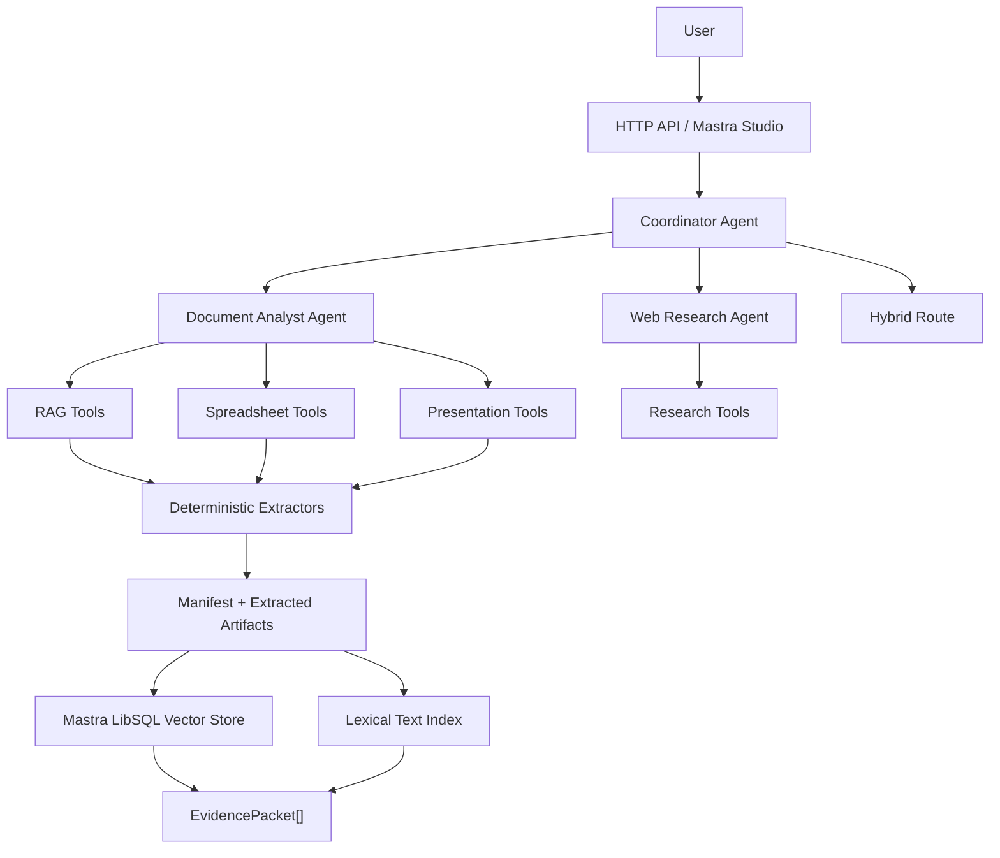

# Project Rewrite Spec: Mastra-Native Multi-Agent Chatbot

Status: Draft for review  
Date: 2026-05-18  
Purpose: interview assignment implementation plan

## 1. Assignment

Build a general-purpose chatbot that can:

1. Answer research questions by looking up information.
2. Analyze user-uploaded PDFs, PowerPoints, Excel files, CSV files, and Word documents.

The system must:

- Use Mastra.
- Use a multi-agent architecture.
- Include a coordination mechanism between agents.
- Explore multiple RAG approaches and explain the trade-offs during discussion.

Important scope decision:

- This is **not** a BPSS-specific product. Existing BPSS-style data can stay as optional fixture data, but the architecture should present as a general-purpose research + document chatbot.
- We will implement **one robust final RAG pipeline** and document the alternatives explored so the interview explanation is clear without overbuilding.

## 2. Recommended Direction

Use **Option B: Mastra-native core with deterministic document services**.

This means:

- Mastra owns the agent layer, tool registration, memory, future workflows, RAG tool surface, and Studio demo.
- Deterministic services own file storage, extraction, spreadsheet querying, evidence packet creation, and citation locators.
- The app remains simple enough to explain but serious enough to show production judgement.

The core story:

> A coordinator routes each request to either the document analyst agent, the web research agent, or a hybrid path. The document analyst uses a robust hybrid RAG pipeline: Mastra RAG/vector retrieval for narrative documents, structured querying for spreadsheets, and lexical fallback when embeddings are unavailable.

## 3. Current Project Assessment

Already valuable:

- Session-scoped upload model with `userId`, `sessionId`, stable `fileId`, immutable originals, manifests, and extracted artifacts.
- Extractors for PDF, DOCX, PPTX, Excel, and CSV.
- Evidence packets with page, slide, sheet, row, block, and chart locators.
- Existing coordinator, document analyst, and research agents.
- Deterministic fallback path when no LLM provider is configured.

Needs improvement:

- Mastra should be more visibly central.
- Tool files should be organized by capability instead of one giant mixed document tool file.
- RAG should use Mastra primitives for narrative retrieval, not only custom lexical search.
- The demo should explain RAG alternatives and why the final hybrid pipeline was selected.

## 4. Agent Architecture

Keep the current agent count small.

### Coordinator / Router Agent

Responsibilities:

- Classify intent as document, research, hybrid, intake/status, or clarification.
- Route to the smallest useful specialist.
- Ask a clarifying question when the user says “this file/document” and multiple files exist.
- Inspect uploaded-file status before sending document-heavy work downstream.

### Document Analyst Agent

Responsibilities:

- Answer questions over uploaded files.
- Use evidence-first tools before generating factual claims.
- Cite file/page/slide/sheet/row/block locators.
- Apply low-evidence guardrails instead of guessing.
- Use narrative RAG for PDFs/DOCX/PPTX and structured tools for Excel/CSV.

### Web Research Agent

Responsibilities:

- Look up external/current information.
- Return source URLs and compact snippets.
- Separate web evidence from uploaded-document evidence.

Avoid for V1:

- Separate PDF, DOCX, PPTX, and Excel agents.
- A large supervisor hierarchy.
- Human approval or scheduling flows.

Those sound impressive but add fragility. For this assignment, three agents plus clear routing is the stronger architecture.

## 5. Tool Organization Decision

The current idea of many tools is correct, but placing all of them in one file is not.

### Options Considered

1. **One giant tool file**
   - Fast to write.
   - Hard to review.
   - Makes document, spreadsheet, presentation, upload, and RAG responsibilities blur.

2. **One file per tool**
   - Very explicit.
   - Too much boilerplate.
   - Harder to scan in an interview.

3. **Capability-based tool modules**
   - Balanced, readable, and easy to explain.

### Selected Option

Use capability-based modules:

```text
src/mastra/tools/
  shared.ts
  sessionTools.ts
  ragTools.ts
  spreadsheetTools.ts
  presentationTools.ts
  researchTools.ts
  documentTools.ts
```

Tool responsibilities:

- `sessionTools.ts`: upload, list files, manifest, extraction status.
- `ragTools.ts`: Markdown retrieval, vector/lexical evidence retrieval.
- `spreadsheetTools.ts`: Excel/CSV sheet listing, schema, preview, row query, summary evidence.
- `presentationTools.ts`: slide listing, slide evidence, chart evidence.
- `researchTools.ts`: web lookup.
- `shared.ts`: shared schemas and safe tool execution.
- `documentTools.ts`: compatibility barrel that re-exports grouped document tools.

Why this is best:

- It mirrors the assignment’s two capabilities: research and document analysis.
- It keeps RAG visible as its own capability.
- It lets each agent receive only the tools it needs.
- It is serious architecture without unnecessary ceremony.

## 6. RAG Approaches Explored

We should be ready to discuss these options verbally.

### Approach 1: Full-Document Stuffing

What it is:

- Extract all text and pass it directly into the LLM context.

Why not final:

- Breaks on large PDFs and decks.
- Expensive in tokens.
- Weak citations.
- Poor fit for multi-document sessions.

### Approach 2: Lexical Chunk Search

What it is:

- Chunk extracted text and search using keyword/BM25-style scoring.

What works:

- Local, fast, deterministic.
- Great fallback when no embedding provider is configured.
- Easy to test.

Limitations:

- Misses semantic matches and paraphrases.
- Depends heavily on user wording.

### Approach 3: Naive Vector RAG for Everything

What it is:

- Embed all extracted content, including spreadsheet rows, into one vector index.

What works:

- Better semantic recall for narrative documents.

Limitations:

- Bad fit for spreadsheets because exact filtering, sorting, and row-level reasoning are stronger than approximate semantic matching.
- Can blur table facts and make citations less precise.

### Approach 4: Hybrid Final Pipeline

What it is:

- Use Mastra RAG/vector retrieval for narrative documents.
- Use structured querying for spreadsheets.
- Normalize both outputs into `EvidencePacket[]`.
- Keep lexical search as a fallback.

Decision:

- This is the final pipeline.

Why:

- Matches the shape of each file type.
- Supports precise citations.
- Demonstrates Mastra RAG without pretending every document is the same.
- Stays robust for local demos when embeddings are unavailable.

## 7. Final RAG Pipeline

### Ingestion

1. Store immutable original file under the session.
2. Extract artifacts by file type:
   - PDF: page Markdown/text, optional rendered page artifacts.
   - DOCX: Markdown.
   - PPTX: slide Markdown, slide structure, chart summaries.
   - Excel/CSV: sheet metadata, schema, JSONL row store.
3. For narrative files, build:
   - lexical text index,
   - Mastra RAG vector index when an embedding provider is configured.
4. Update manifest with derived artifact paths.

### Narrative RAG

For PDF/DOCX/PPTX narrative content:

- Use `MDocument.fromMarkdown`.
- Chunk with `semantic-markdown`.
- Embed chunks with the configured embedding model.
- Store vectors in a local LibSQL vector store.
- Attach metadata:
  - `userId`
  - `sessionId`
  - `fileId`
  - `documentType`
  - `page`
  - `slide`
  - `blockId`
  - `originalFilename`
- Query with session/file filters.
- Convert results to `EvidencePacket[]`.

### Spreadsheet Retrieval

For Excel/CSV:

- Do not blindly embed every row for V1.
- Use structured tools:
  - schema,
  - preview,
  - query rows,
  - summarize/describe.
- Return row evidence with sheet and row locators.

### Fallback Behavior

If embeddings are unavailable or vector search returns no useful result:

- Fall back to lexical evidence retrieval.
- Return `retrievalMode: "lexical"`.
- Keep the answer grounded and cite the retrieved evidence.

This is demo-safe and lets the app work even without paid provider credentials.

## 8. Mastra Integration

Mastra should be visible in `src/mastra/index.ts`.

Expected registry:

- `agents`: coordinator, document analyst, web research.
- `storage`: LibSQL storage for Mastra state.
- `vectors`: local LibSQL vector store for document chunks.
- `memory`: session memory for chat continuity.
- `tools`: registered through agents by capability.
- Later phases: workflows, scorers, observability.

Current implementation direction:

- `documentVectorStore` is registered as a Mastra vector store.
- Narrative retrieval uses Mastra `MDocument` chunking.
- Tool boundaries are capability-based.
- Existing lexical retrieval remains as a robust fallback.

## 9. High-Level Architecture



## 10. Implementation Phases

### Phase 1: Tool Boundary Cleanup

Deliverables:

- Split tools into capability-based modules.
- Keep `documentTools.ts` as a barrel export for compatibility.
- Update imports only where useful; avoid broad churn.

Status: implemented.

### Phase 2: Mastra-Aligned RAG Slice

Deliverables:

- Add `@mastra/rag`.
- Add local LibSQL vector store.
- Build vector chunks from extracted Markdown using `MDocument`.
- Query vectors with session/file metadata filters.
- Fall back to lexical search when embeddings are unavailable.

Status: implemented as first robust slice.

### Phase 3: Demo Flow Polish

Deliverables:

- Rename scripts away from BPSS-specific language where needed.
- Add a generic sample-data seed path.
- Update README with a 5-minute assignment demo script.

Status: next.

### Phase 4: Workflows

Deliverables:

- Add `ingestDocumentWorkflow`.
- Add `answerQuestionWorkflow`.
- Expose workflow progress in Mastra Studio.

Status: planned.

### Phase 5: Evals and Observability

Deliverables:

- Add citation coverage scorer.
- Add groundedness scorer.
- Add basic trace/log visibility for retrieval and tool calls.

Status: planned.

## 11. Acceptance Criteria

Must pass:

- User can upload supported document types.
- Router chooses document, research, hybrid, intake/status, or clarification path.
- Document answers are grounded in `EvidencePacket[]`.
- PDF/DOCX/PPTX narrative retrieval uses Mastra RAG chunking/vector retrieval when embeddings are configured.
- Excel/CSV retrieval uses structured row tools.
- Lexical fallback works without embedding credentials.
- Research answers include URLs.
- Code remains easy to explain.

Nice to have:

- Workflow graph in Mastra Studio.
- Scorer output for citation coverage.
- Observability trace for one full answer.

## 12. Interview Talking Points

Use this explanation:

> I explored full-context stuffing, lexical search, naive vector RAG, and a hybrid pipeline. Full-context stuffing was simple but fragile and expensive. Lexical search was reliable and local but weaker for semantic queries. Naive vector RAG worked for narrative docs but was the wrong abstraction for spreadsheets. The final design uses Mastra RAG for narrative documents, structured querying for spreadsheets, and normalizes everything into citation-ready evidence packets.

Architecture explanation:

> I kept the agents small: coordinator, document analyst, and web research. I avoided per-file-type agents because tools are the better abstraction here. The coordination mechanism routes requests, checks document readiness, and prevents ambiguous “this document” prompts from becoming hallucinations.

Tool explanation:

> Tools are grouped by capability, not dumped into one file. That makes the project easier to review and makes it clear which agent can do what.

## 13. Immediate Next Steps

1. Verify the new tool modules and RAG vector slice compile.
2. Run the smoke test.
3. Update README to match the assignment and remove BPSS-first framing.
4. Add a generic scripted demo flow.
5. Add Mastra workflows once the core RAG path is stable.
