# V2 Mermaid Architecture

This document is the visual version of the V2 design. It shows the end-to-end system, async ingestion, agent boundaries, retrieval strategy, and evidence flow.

## 1. System Context

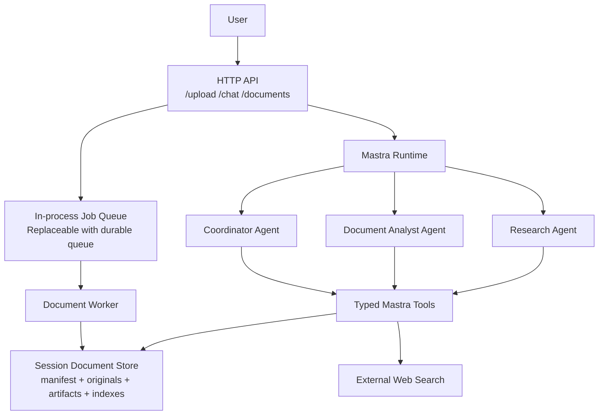

## 2. Runtime Component Boundary

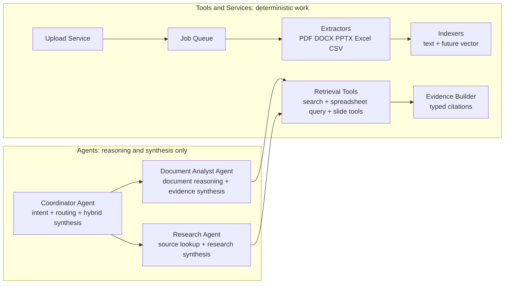

## 3. Agent Decision Flow

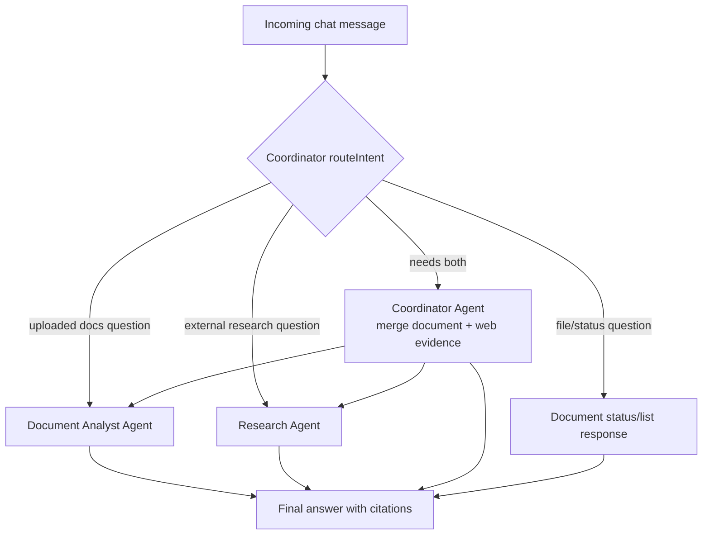

## 4. Async Upload and Ingestion Flow

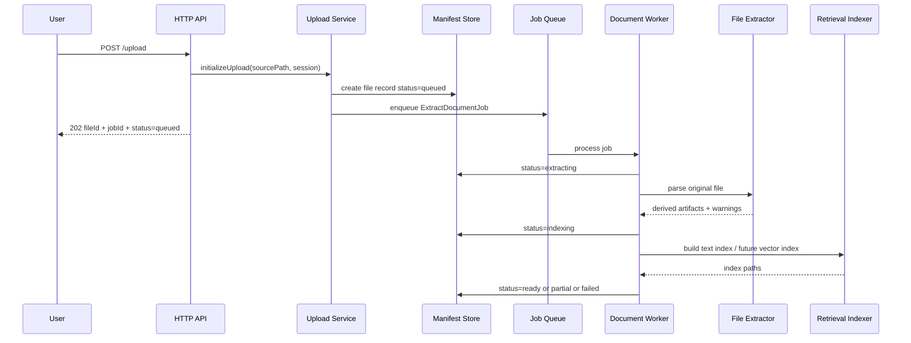

## 5. Document Status State Machine

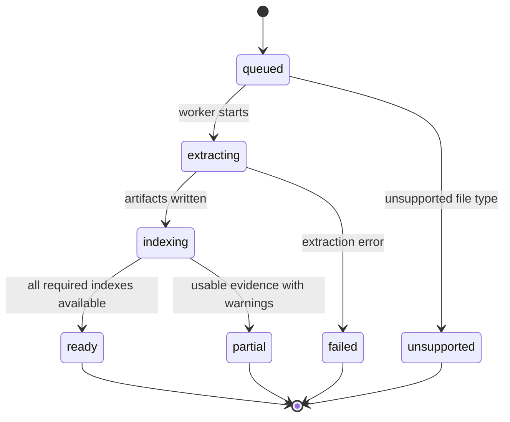

## 6. Artifact and Index Layout

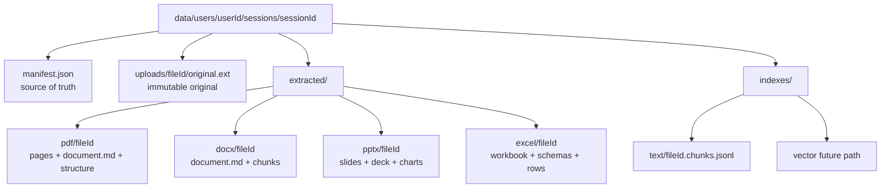

## 7. Retrieval Strategy by Document Type

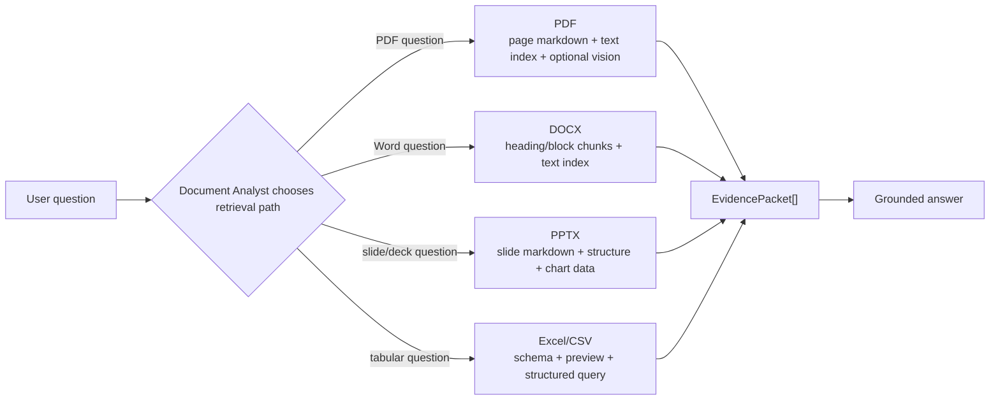

## 8. Text Retrieval Flow

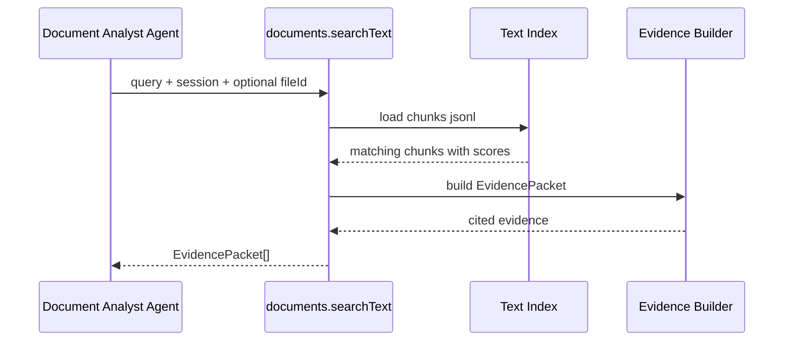

## 9. Spreadsheet Retrieval Flow

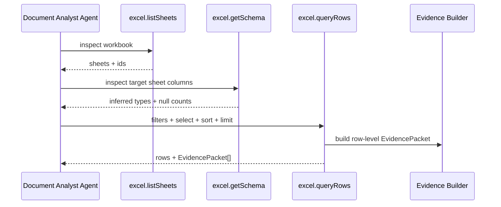

## 10. Evidence Packet Model

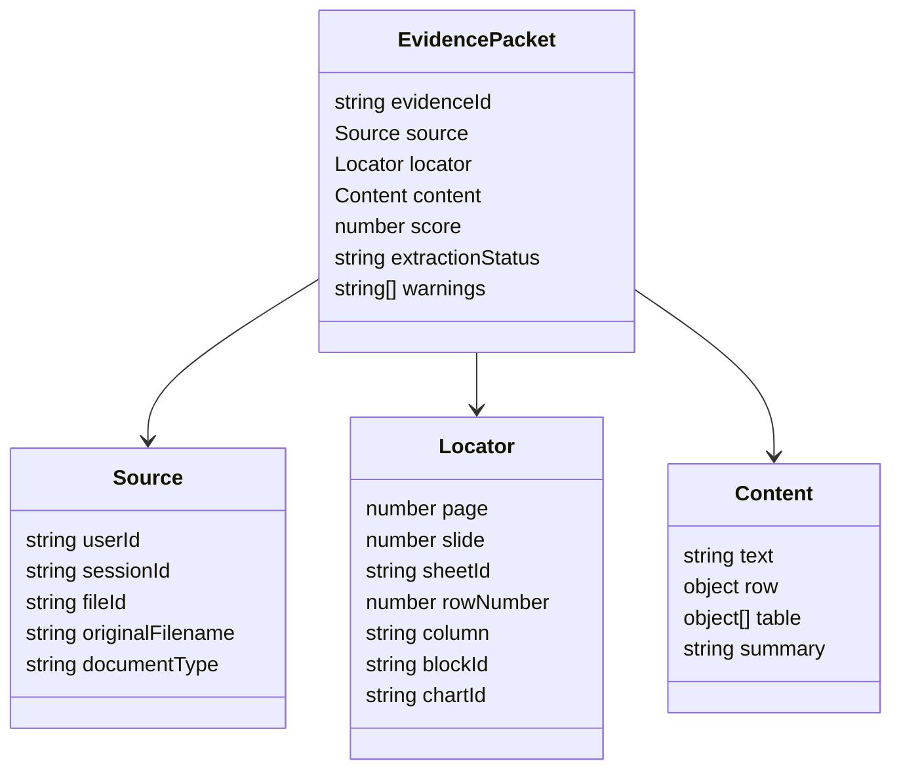

## 11. Hybrid Question Flow

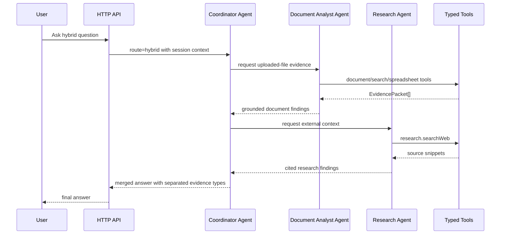

## 12. Module Map

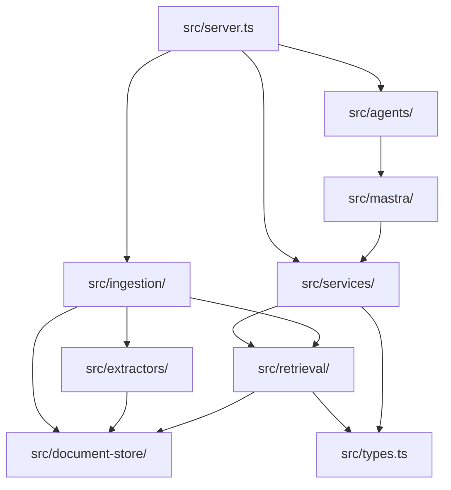

## 13. Interview Summary Diagram

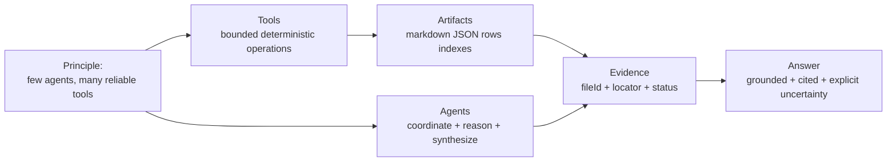
